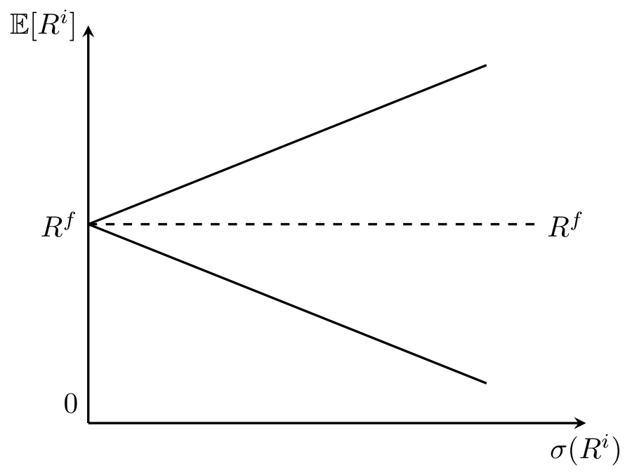

::: {.hidden}
$$
 \def\BB#1{{\mathbb{#1}}}
 \def\BF#1{{\mathbf{#1}}}
 \def\E{{\mathbb{E}}}
$$
:::

*yedlu, Winter 2024*

## Consumption Pricing Characteristics
### Model Assumption
One beauty of consumption-based pricing is that it requires very little assumption. One assumption that has to be satisfied is the investor is able to trade arbitrarily-small $\xi$ units of asset. 

Here's a list of assumptions that the general consumption-based pricing do not assume:  

| Assumption | Notes |
| :-: | :------ |
| Complete Markets | Measures individual-level willingness to pay, everyone can have different $p$ under incomplete markets|
| Specific Return Distribution | Can take any return distribution |
| Representative/Marginal Investor | The SDF can be heterogenous to measure different types of investors |
| Specific Utility Functions | Can take any form form of utility functions | 
| Market Equilibrium | Willingness to pay do not need market equilibrium to exist |
| 2-Period Model | Can be expanded to multi-period form (later on) |
| Specific Beginning Endowment | Can take any level of endowment |

### Reaching Equilibrium
In much rigor terms, $p$ denotes individual investor's **willingness to pay** to an asset. From above we know that the market does not have to be in eqilibrium for using the consumption-based pricing.  
We will show now that, nevertheless, the market will finally be in congruent with the individual willingness to pay, reaching an equilibrium.  
To begin with, purchasing $\xi$ units of asset in extra will increase the utility in the future by (discounted to today): 

$$\begin{aligned}
  & \beta \E [u(c_{t+1} + \xi x_{t+1}) - u(c_{t+1})] \\
  = & \beta \E [u'(c_{t+1}) \, \xi x_{t+1} + ...]
\end{aligned}$$

For an arbitrarily small $\xi$, only the first-order Taylor Expansion matters.  

Similarly, purchasing $\xi$ units of asset will decrease today's consumption. Using first-order Taylor expansion:  
$$\begin{aligned}
  & u(c_t - \xi v_t) \\
  = & u'(c_t) \xi v_t + ... 
\end{aligned}$$

Optimality is reached if the investor is indifferent to buy additional $\xi$ units of asset. How does market reach equilibrium:  

| Scenario | Mechanism | 
| --- | ------- |
| $v_t > p_t$ | Investor buys more asset because it is below valuation, then drives $c_t$ down and $\E [c_{t+1}]$ up. Convexity drives the SDF down, hence $v_t$ dropped till equilibrium. |
| $v_t < p_t$ | Investor buys less asset because it is above valuation, driving $c_t$ up and $\E [c_{t+1}]$ down. Convexity drives the SDF up, hence $v_t$ increased till equilibrium. |
| $v_t = p_t$ | In equilibrium. |

### Interconnected Random Variable
From above we know that neither $p$ and $c$ are exogenous. They are linked through the consumption-based pricing model and interact each other. Specifically,  

- knowing $\E [mx]$ yields the willingness to pay $p$;
- knowing $p$ yields investment decisions today.

## Mean-Variance Frontier (Hansen-Jagannathan Bounds)
### Derivation
Given an asset's riskiness, is there a reasonable bound for the return of the asset? We will try to derive the mean-variance frontier from our consumption pricing model.  

$$\begin{aligned}
  1 &= \E [mR^i] \\
  &= \E[m] \E[R^i] + \sigma(m, R^i) \\
  &= \frac{\E[R^i]}{R^f} + \rho (m, R^i) \sigma(m) \sigma(R^i)
\end{aligned}$$

Rewriting the equation we would have:  
$$\begin{aligned}
  \E [R^i] - R^f &= - R^f \rho (m, R^i) \sigma(m) \sigma(R^i) \\
  R^f = \frac{1}{\E[m]} \implies \E [R^i] - R^f &= - \rho (m, R^i) \frac{\sigma(m)}{\E[m]} \sigma(R^i)
\end{aligned}$$

By *Cauchy-Schwarz inequality*:  
$$\begin{aligned}
  \mid \E [R^i] - R^f \mid &\leq \frac{\sigma(m)}{\E[m]} \sigma(R^i)
\end{aligned}$$

### Graphical Illustration
{fig-align="center" width=75%}  

Assets on the upper bound:  
$$\begin{aligned}
  \E [R^i] &= R^f + \frac{\sigma(m)}{\E[m]} \sigma(R^i)
\end{aligned}$$
implies the correlation $\rho(m, R^i) = -1$. The asset return has perfect negative correlation with the SDF (hence perfect positive correlation with consumption). These types of asset bring higher volatility to consumption, thus investors would require a much higher excess return. One example would be stocks that goes high when market is bullist and plummets when market is bearish.  

The lower bound, on the opposite,  
$$\begin{aligned}
  \E [R^i] &= R^f - \frac{\sigma(m)}{\E[m]} \sigma(R^i)
\end{aligned}$$
describes assets with high returns when consumptions are low. Consider insurances: normal investors would not require a high excess return on insurance products generally, as long as they can use these products to smoothen consumption levels across time and states.

### Illustration
We can compare assets within the wedge-shaped mean-variance frontier through two ways:  

- **Horizontally**. If two assets (their corresponding points in the graph) lies under one horizontal line, then they have the same expected returns ($\E[R^i]$). The asset on the left has lower overall risk ($\sigma(R^i)$) which can be attributed to idiosyncratic risks.  
- **Vertically**. If two assets (their corresponding points in the graph) lies under one vertical line, then they have the same overall risk. The one that has a higher expected return (on the top) has a higher consumption-payoff correlation.

### Sharpe Ratio
The Sharpe ratio measures the excess return (per unit of risk) and is defined as:  
$$\begin{aligned}
  \frac{\E[R^i] - R^f}{\sigma(R^i)}
\end{aligned}$$

We can connect Sharpe ratio with the mean-variance frontier:  
$$\begin{aligned}
  \mid \frac{\E[R^i] - R^f}{\sigma(R^i)} \mid &\leq \frac{\sigma(m)}{\E[m]}
\end{aligned}$$
**Intuition**: the slope of the mean-variance frontier wedge is the maximum Sharpe ratio available.

## Multi-Period Pricing
### Setting
Now, the asset pays a stream of cash flows $\{\delta_{t+j}\}$ in the future. How should we price this multi-period asset?  

### Optimization
Let's revisit the optimization problem:  
$$\begin{aligned}
  \max_{c_{t+j}} & \quad \BB{E}_t \left[\sum_{j = 0}^{\infty} \beta^j u(c_{t+j})\right] \\
  \text{s.t.} & \quad  c_t(\xi) = e_t - p_t \xi \\
  & c_{t+j}(\xi) = e_{t+j} + \delta_{t+j} \xi \quad (j \leq 1)
\end{aligned}$$

Rearranging the objective function:  
$$\begin{aligned}
  \max_{\xi} & \quad \left[u(e_t - p_t \xi) + \BB{E}_t \left[ \sum_{j = 1}^{\infty} \beta^j u(e_{t+j} + \delta_{t+j} \xi) \right] \right]
\end{aligned}$$

The first-order condition (FOC) w.r.t $\xi$ of this objective function be:  
$$\begin{aligned}
  - p_t u'(c_t) + \E_t \left[\sum_{j = 1}^{\infty} \beta^j \delta_{t+j} u'(c_{t+j}) \right] = 0
\end{aligned}$$

### Solution
Solving for the price (willingness to pay):  
$$\begin{aligned}
  p_t &= \E_t \left[\sum_{j = 1}^{\infty} \beta^j \frac{u'(c_{t+j})}{u'(c_t)} \delta_{t+j} \right]
\end{aligned}$$

We define the multi-period stochastic discount factor (SDF) as:  
$$\begin{aligned}
  m_{t+j} &:= \beta^j \frac{u'(c_{t+j})}{u'(c_t)} \quad (j \geq 1)
\end{aligned}$$

### Risk-Adjusted Form
As in the two-period model, we can also rewrite prices as it is explicitly risk-adjusted:  
$$\begin{aligned}
  p_t &= \sum_{j = 1}^{\infty} \left[ \frac{\E_t [\delta_{t+j}]}{R^f_{t, t+j}} + \sigma(\delta_{t+j}, m_{t, t+j}) \right]
\end{aligned}$$